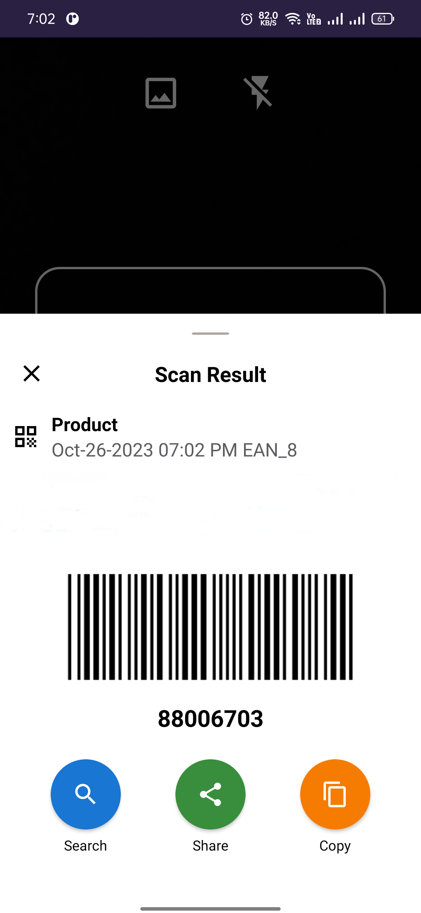
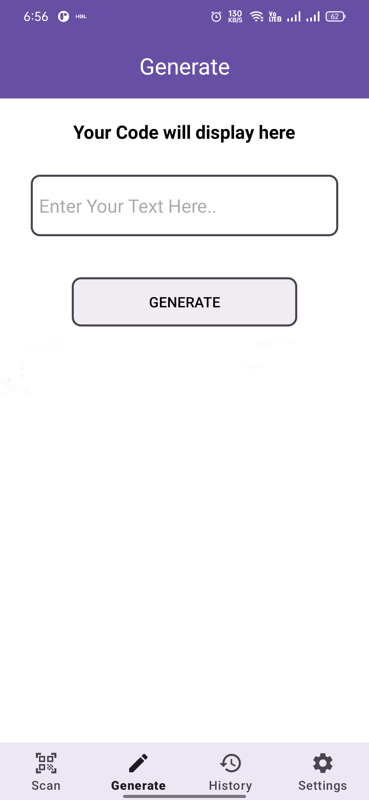
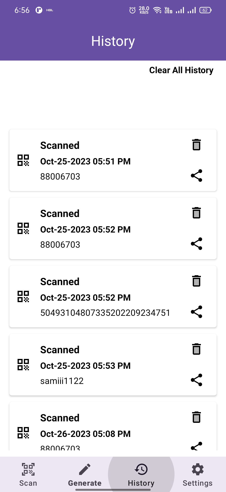

# QRBarcodeReader
A simple QR Code Scanner Android application written in Java, utilizing Google's ML Kit for barcode scanning.

## Description

QR & Barcode Scanner / QR code reader is extremely easy to use; with quick scan built in simply point QR code scanner free app to QR or barcode you want to scan and QR scanner will automatically start scanning and QR scan it. No need to press any buttons, take photos or adjust zoom as barcode reader works automatically.

## Screenshots





## Features
- **QR Code Scanning**: Quickly scan and decode QR codes.
- **Barcode Scanning**: Supports various barcode formats, including QR codes, using ML Kit's Barcode Scanning API.
- **Instant Results**: Display scanned content instantly within the app.
- **Camera Integration**: Utilizes the device's camera to scan QR codes in real-time.

## Technologies Used

- **Programming Language**: Java
- **IDE**: Android Studio
- **ML Kit**: Google's Machine Learning Kit used for barcode and QR code scanning
- **Android SDK**: Leveraging Android's native camera APIs and other components

## Prerequisites

Before running the app, ensure that you have:

- Android Studio installed.
- A device or emulator with a camera to test the QR code scanner.

## Dependencies
implementation 'com.google.mlkit:barcode-scanning:17.0.0'

## Installation
1. **Clone the repository:**
   ```bash
   git clone (https://github.com/asim-ghani/QRBarcodeReader.git)
   
2. **Open in Android Studio:**
    Open Android Studio.
    Select File > Open and navigate to the cloned project directory.
   
4. **Build the Project:**
    Allow Gradle to sync and build the project.

5. **Run the App:**
Connect an Android device or start an emulator.
Click on the "Run" button in Android Studio to install the app on the device.
